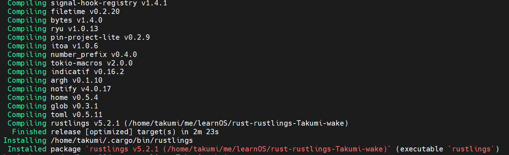

# rustlings安装编译报错

## 问题描述

当执行 `cargo install --path .`安装rustlings时，出现 "Couldn't resolve host name (Could not resolve host: static.crates.io)"等报错，打印如下：

```bash
Installing rustlings v5.2.1 (/home/takumi/me/learnOS/rust-rustlings-Takumi-wake)
    Updating crates.io index
warning: spurious network error (2 tries remaining): [6] Couldn't resolve host name (Could not resolve host: crates.io)
warning: spurious network error (2 tries remaining): [6] Couldn't resolve host name (Could not resolve host: crates.io)
warning: spurious network error (2 tries remaining): [6] Couldn't resolve host name (Could not resolve host: crates.io)
warning: spurious network error (2 tries remaining): [6] Couldn't resolve host name (Could not resolve host: crates.io)
warning: spurious network error (2 tries remaining): [6] Couldn't resolve host name (Could not resolve host: static.crates.io)
warning: spurious network error (2 tries remaining): [6] Couldn't resolve host name (Could not resolve host: static.crates.io)
warning: spurious network error (2 tries remaining): [6] Couldn't resolve host name (Could not resolve host: static.crates.io)
warning: spurious network error (2 tries remaining): [6] Couldn't resolve host name (Could not resolve host: static.crates.io)
warning: spurious network error (2 tries remaining): [6] Couldn't resolve host name (Could not resolve host: static.crates.io)
warning: spurious network error (2 tries remaining): [6] Couldn't resolve host name (Could not resolve host: static.crates.io)
warning: spurious network error (2 tries remaining): [6] Couldn't resolve host name (Could not resolve host: static.crates.io)
warning: spurious network error (1 tries remaining): [6] Couldn't resolve host name (Could not resolve host: static.crates.io)
warning: spurious network error (2 tries remaining): [6] Couldn't resolve host name (Could not resolve host: static.crates.io)
warning: spurious network error (2 tries remaining): [6] Couldn't resolve host name (Could not resolve host: static.crates.io)
warning: spurious network error (2 tries remaining): [6] Couldn't resolve host name (Could not resolve host: static.crates.io)
warning: spurious network error (2 tries remaining): [6] Couldn't resolve host name (Could not resolve host: static.crates.io)
warning: spurious network error (1 tries remaining): [6] Couldn't resolve host name (Could not resolve host: static.crates.io)
warning: spurious network error (2 tries remaining): [6] Couldn't resolve host name (Could not resolve host: static.crates.io)
warning: spurious network error (2 tries remaining): [6] Couldn't resolve host name (Could not resolve host: static.crates.io)
warning: spurious network error (2 tries remaining): [6] Couldn't resolve host name (Could not resolve host: static.crates.io)
warning: spurious network error (1 tries remaining): [6] Couldn't resolve host name (Could not resolve host: static.crates.io)
warning: spurious network error (2 tries remaining): [6] Couldn't resolve host name (Could not resolve host: static.crates.io)
warning: spurious network error (2 tries remaining): [6] Couldn't resolve host name (Could not resolve host: static.crates.io)
warning: spurious network error (2 tries remaining): [6] Couldn't resolve host name (Could not resolve host: static.crates.io)
warning: spurious network error (2 tries remaining): [6] Couldn't resolve host name (Could not resolve host: static.crates.io)
warning: spurious network error (1 tries remaining): [6] Couldn't resolve host name (Could not resolve host: static.crates.io)
warning: spurious network error (2 tries remaining): [6] Couldn't resolve host name (Could not resolve host: static.crates.io)
warning: spurious network error (2 tries remaining): [6] Couldn't resolve host name (Could not resolve host: static.crates.io)
warning: spurious network error (1 tries remaining): [6] Couldn't resolve host name (Could not resolve host: static.crates.io)
warning: spurious network error (2 tries remaining): [6] Couldn't resolve host name (Could not resolve host: static.crates.io)
warning: spurious network error (1 tries remaining): [6] Couldn't resolve host name (Could not resolve host: static.crates.io)
warning: spurious network error (1 tries remaining): [6] Couldn't resolve host name (Could not resolve host: static.crates.io)
warning: spurious network error (2 tries remaining): [6] Couldn't resolve host name (Could not resolve host: static.crates.io)
error: failed to compile `rustlings v5.2.1 (/home/takumi/me/learnOS/rust-rustlings-Takumi-wake)`, intermediate artifacts can be found at `/home/takumi/me/learnOS/rust-rustlings-Takumi-wake/target`

Caused by:
  failed to download from `https://crates.io/api/v1/crates/aho-corasick/0.7.20/download`

Caused by:
  [6] Couldn't resolve host name (Could not resolve host: static.crates.io)
```

检查网络并尝试更新rust版本，无果。

## 问题排查

目前看问题主要是”Couldn't resolve host name (Could not resolve host: static.crates.io)“，从而导致下载失败，根据 [Rust Crates 源使用帮助](https://mirrors.ustc.edu.cn/help/crates.io-index.html) 中的说明，尝试更新Crates 源，在 `$HOME/.cargo/config` 中添加如下内容：

```
[source.crates-io]
replace-with = 'ustc'

[source.ustc]
registry = "git://mirrors.ustc.edu.cn/crates.io-index"
```

重新执行 `cargo install --path .` 编译成功，如下图所示



## 参考链接

- [Rust Crates 源使用帮助 — USTC Mirror Help 文档](https://mirrors.ustc.edu.cn/help/crates.io-index.html)
- [Rust编译：Couldn‘t resolve host name](https://blog.csdn.net/inthat/article/details/118853498)
