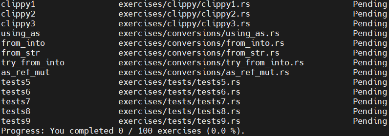

# LearningOS_Something_Record

## 仓库说明

本仓库用于记录在LearningOS_Comp2023的学习过程中，进行实验和测试所遇到的各类问题，以及解决过程和方法总结，由于还存在其他工作时间安排，学习记录的大致更新时间以周为单位，记录内容大致如下：

- rust语言学习总结
- 问题排查总结
- OS学习总结
- 其他

## 相关链接

- [2023年秋季开源操作系统训练营：第一阶段](https://github.com/LearningOS/rust-based-os-comp2023/blob/main/2023-autumn-scheduling-1.md#2023%E5%B9%B4%E7%A7%8B%E5%AD%A3%E5%BC%80%E6%BA%90%E6%93%8D%E4%BD%9C%E7%B3%BB%E7%BB%9F%E8%AE%AD%E7%BB%83%E8%90%A5%E7%AC%AC%E4%B8%80%E9%98%B6%E6%AE%B5)

> - [The Learning &amp; Training Hub of OS Kernel](https://github.com/LearningOS)
> - [LearningOS/rust-based-os-comp2023: 2023春夏季开源操作系统训练营](https://github.com/LearningOS/rust-based-os-comp2023)
> - [2023春夏季开源操作系统训练营 每日/周学习实践过程记录](https://github.com/LearningOS/rust-based-os-comp2023/discussions/170)

## Week 1: 20231009 - 20231015

### rustlings仓库本地安装

本地环境配置不再赘述，新的改动是使用了字节的源，参考 `https://rsproxy.cn/`，`$HOME/.cargo/config` 中更新为如下内容：

```bash
# [source.crates-io]
# registry = "https://github.com/rust-lang/crates.io-index"
# replace-with = 'ustc'
# [source.ustc]
# registry = "git://mirrors.ustc.edu.cn/crates.io-index"

[source.crates-io]
replace-with = 'rsproxy'
[source.rsproxy]
registry = "https://rsproxy.cn/crates.io-index"
[source.rsproxy-sparse]
registry = "sparse+https://rsproxy.cn/index/"
[registries.rsproxy]
index = "https://rsproxy.cn/crates.io-index"
[net]
git-fetch-with-cli = true

```

本地安装rustlings

```bash
# git clone git@github.com:LearningOS/rust-rustlings-2023-autumn-Takumi-wake.git
# cd rustlings
# cargo install --force --path .
```

安装成功后，执行 `rustlings list`，即显示为完整的exercise



---

## First Week *20230403 - 20230409*

### rustlings仓库的更新

根据现有信息，可以看到，[rust-based-os-comp2023](https://github.com/LearningOS/rust-based-os-comp2023)提供的 `rustilngs github classrom` 是从 [rustlings-template](https://github.com/LearningOS/rustlings-template) 仓库生成的，从readme中的信息，该仓库应该是基于 [rust-lang/rustlings](https://github.com/rust-lang/rustlings) 仓库的 `tag 5.2.1` 拉取出来的，目前 `rustlings` 仓库最新已经更新到5.4.1，因此，准备将训练营的仓库也更新到最新版本。

实际更新中发现，训练营中的仓库 [rustlings-template](https://github.com/LearningOS/rustlings-template) 和 [rust-lang/rustlings](https://github.com/rust-lang/rustlings)仓库的最新release的 `tag 5.4.1`的历史提交存在较大出入，由于担心直接更新可能导致后续的ci执行可能没有完全适配，因此，暂时只将该 `tag 5.4.1`更新到自己的仓库分支 [LearningOS/rust-rustlings-Takumi-wake at rustlings_5.4.1](https://github.com/LearningOS/rust-rustlings-Takumi-wake/tree/rustlings_5.4.1)，用于自己学习使用。

另外，在推送过程遇到 `fix git push error: shallow update not allowed` 问题，解决过程详见 [fix git push error: shallow update not allowed](./notedoc/fix_git_push_error_shallow_update_not_allowed.md)

### rustlings安装报错

当执行 `cargo install --path .`安装rustlings时，出现 "Couldn't resolve host name (Could not resolve host: static.crates.io)"等报错，解决过程详见 [rustlings安装编译报错](notedoc/rustlings安装编译报错.md)

### GitHub CI迁移到GitLink

相关准备工作

### rustlings内容练习

#### [Rust语言圣经(Rust Course)](https://course.rs/about-book.html) - 阅读

#### rustlings完成情况

- complete exercises：intro/variables/if/functions/quiz1/primitive_types

## Second Week *20230410 - 202304016*

> 这周工作上的项目的事情有点多，基本没有太多的事情投入到这块上来，算是周末把题目给刷完了，害，年轻人不要熬夜！

### rustlings内容练习

- 刷完rustlings剩余的exercises，智能指针/并发/迭代器等部分后面需要再花时间看一下

### GitHub CI迁移到GitLink

本周没有什么进展，同步一下之前的记录，详见链接 [学习笔记/gitlink_CI实践问题记录.md-LearningOSCI迁移小组/info](https://gitlink.org.cn/hub2link/grp_info/tree/master/%E5%AD%A6%E4%B9%A0%E7%AC%94%E8%AE%B0%2Fgitlink_CI%E5%AE%9E%E8%B7%B5%E9%97%AE%E9%A2%98%E8%AE%B0%E5%BD%95.md)
